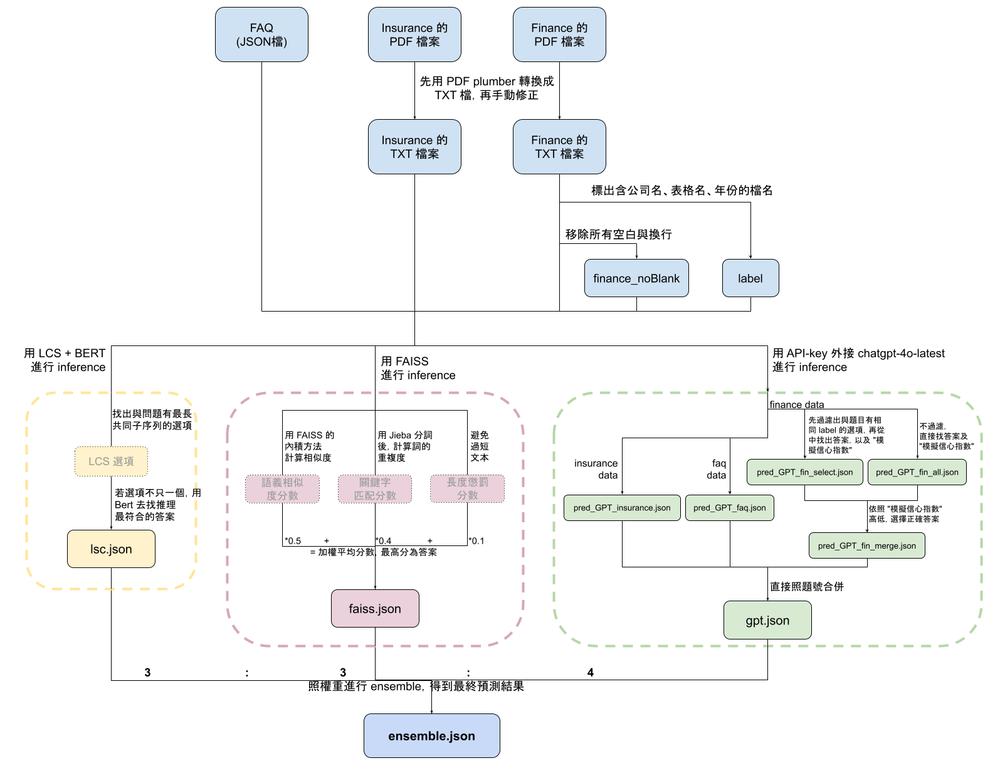

# Implementation Flowchart


## How to Run the Code
1. See `README.md` in the `Preprocess` folder and follow the instructions.
2. See `README.md` in the `Model` folder and follow the instructions.

## Architecture
```
.
├── Model/ (see README.md in Model/ to get more information)
├── Preprocess/ (see README.md in Preprocess/ to get more information)
├── .gitignore
├── requirements.txt
└── README.md
```